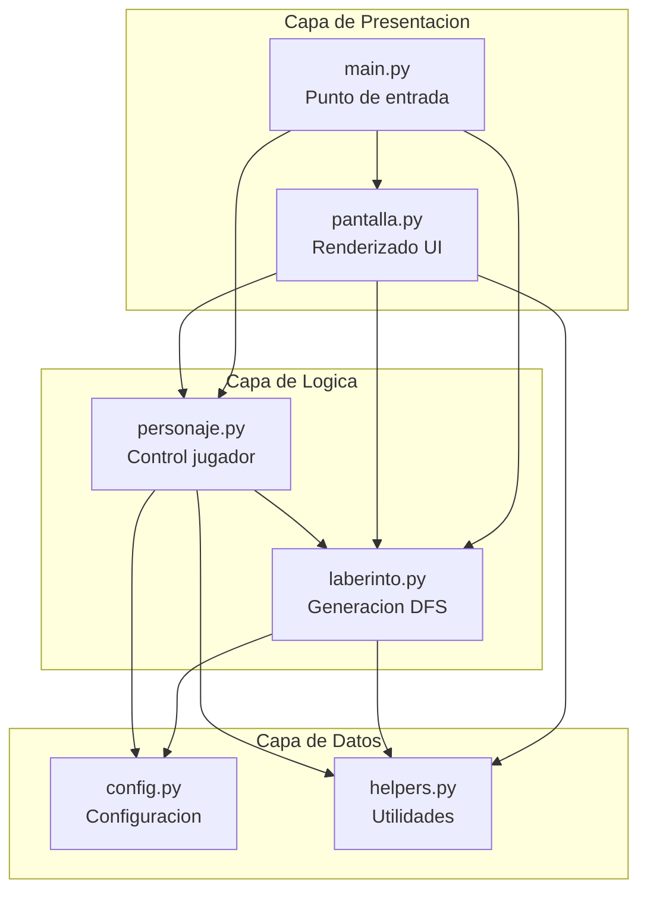
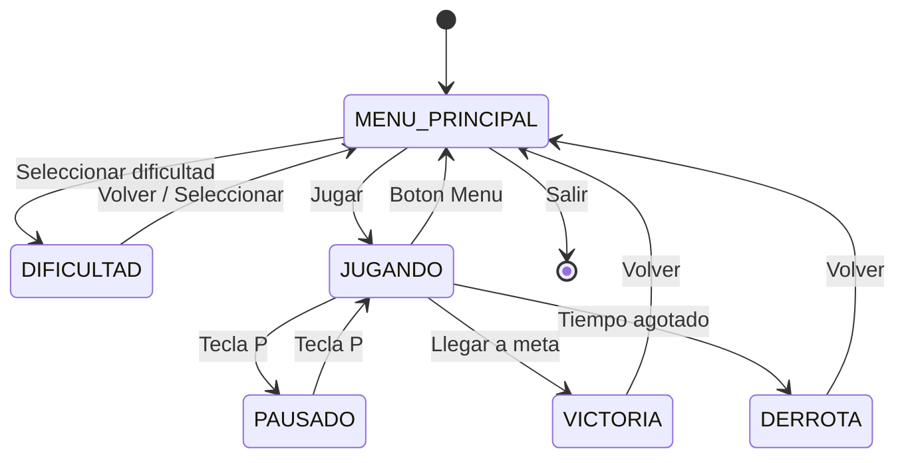
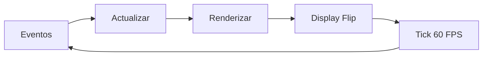
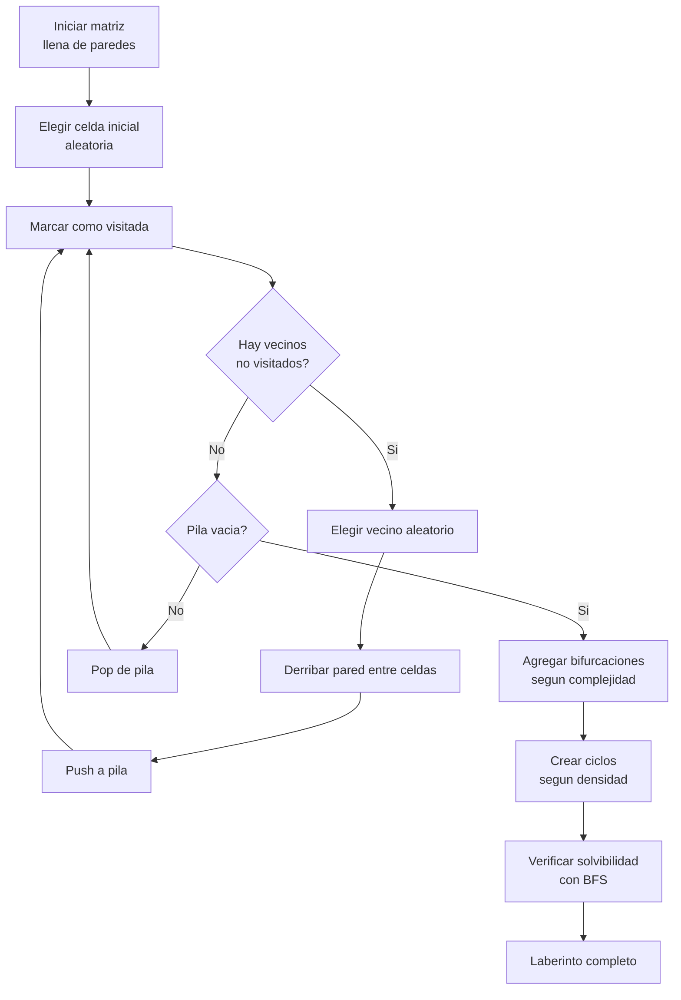

# GENERADOR DE LABERINTOS

<div align="center">


[](https://www.python.org/)
[](https://www.pygame.org/)
[](https://numpy.org/)
[](LICENSE)
[]()

**Juego de laberintos generados proceduralmente con algoritmo DFS modificado**

[Instalacion](#instalacion) •
[Como Jugar](#como-jugar) •
[Arquitectura](#arquitectura) •
[Contribuir](#contribuir)

</div>

---

## TABLA DE CONTENIDOS

- [Descripcion](#descripcion)
- [Caracteristicas](#caracteristicas)
- [Instalacion](#instalacion)
- [Ejecucion](#ejecucion)
- [Como Jugar](#como-jugar)
- [Niveles de Dificultad](#niveles-de-dificultad)
- [Arquitectura](#arquitectura)
- [Algoritmo de Generacion](#algoritmo-de-generacion)
- [Estructura del Proyecto](#estructura-del-proyecto)
- [API Reference](#api-reference)
- [Tests](#tests)
- [Contribuir](#contribuir)
- [Changelog](#changelog)
- [Licencia](#licencia)

---

## DESCRIPCION

Generador de laberintos es un juego desarrollado en Python que crea laberintos unicos en cada partida mediante generacion procedural. El jugador debe navegar desde el punto de inicio hasta la meta antes de que se agote el tiempo.

### POR QUE ESTE PROYECTO?

- **Educativo**: Implementacion practica de algoritmos de grafos (DFS, BFS)
- **Modular**: Arquitectura limpia siguiendo principios SOLID
- **Documentado**: Codigo exhaustivamente comentado para la comunidad dev
- **Testeado**: 91 tests unitarios con pytest

---

## CARACTERISTICAS

| Caracteristica | Descripcion |
|----------------|-------------|
| **Generacion Procedural** | Algoritmo DFS modificado que garantiza laberintos siempre resolubles |
| **5 Niveles de Dificultad** | Desde 15x15 hasta 55x55 celdas con complejidad progresiva |
| **Sistema de Camara** | Seguimiento suave del jugador con interpolacion lineal |
| **Indicador de Meta** | Flecha direccional cuando la meta no es visible |
| **Pausa** | Sistema de pausa con tecla P que congela el temporizador |
| **Responsive** | Tamano de celda dinamico que se adapta a cualquier dificultad |

---

## INSTALACION

### REQUISITOS PREVIOS

- Python 3.8 o superior
- pip (gestor de paquetes de Python)
- Git

### INSTALACION RAPIDA

```bash
# Clonar el repositorio
git clone https://github.com/686f6c61/generador-laberintos-python.git
cd generador-laberintos-python

# Opcion 1: Ejecutar directamente (crea entorno virtual automaticamente)
./run.sh

# Opcion 2: Instalacion manual
python3 -m venv .venv
source .venv/bin/activate
pip install -r requirements.txt
```

### DEPENDENCIAS

```txt
pygame>=2.5.0    # Motor grafico y manejo de eventos
numpy>=1.24.0    # Matrices optimizadas para el laberinto
```

---

## EJECUCION

```bash
# Metodo recomendado (gestiona entorno virtual automaticamente)
./run.sh

# Ejecucion directa
python3 src/main.py

# Ejecutar tests
python3 -m pytest tests/ -v
```

---

## COMO JUGAR

### CONTROLES

| Tecla | Accion |
|-------|--------|
| `↑` `↓` `←` `→` | Mover personaje |
| `P` | Pausar / Reanudar |
| `Boton Menu` | Volver al menu principal |

### OBJETIVO

1. **Inicio**: Circulo rojo - punto de partida
2. **Meta**: Circulo verde - destino final
3. **Jugador**: Circulo azul - tu personaje
4. Llega a la meta antes de que el tiempo se agote

### INTERFAZ

```
┌─────────────────────────────────────────┐
│  Tiempo: 00:45    Distancia: 12 celdas  │  ← Panel Superior
├─────────────────────────────────────────┤
│                                         │
│           ████████████████              │
│           █              █              │
│           █  ██████  ██  █              │
│           █  █    █   █  █              │
│           █  █ ●  ████   █              │  ← Area de Juego
│           █  █         █ █              │
│           █  ███████████ █              │
│           █              █              │
│           ████████████████              │
│                                         │
├─────────────────────────────────────────┤
│  [Menu]              v0.2  686f6c61     │  ← Panel Inferior
└─────────────────────────────────────────┘
```

---

## NIVELES DE DIFICULTAD

| Nivel | Tamano | Celdas | Complejidad | Densidad | Tiempo |
|-------|--------|--------|-------------|----------|--------|
| Facil | 15×15 | 225 | 0.5 | 0.5 | 2 min |
| Normal | 25×25 | 625 | 0.6 | 0.6 | 3 min |
| Dificil | 35×35 | 1,225 | 0.7 | 0.7 | 4 min |
| Muy Dificil | 45×45 | 2,025 | 0.8 | 0.8 | 5 min |
| Extremo | 55×55 | 3,025 | 0.9 | 0.9 | 6 min |

> **Nota**: El tamano de celda se calcula dinamicamente para que el laberinto siempre quepa en la ventana (800x600 - paneles HUD).

---

## ARQUITECTURA

### DIAGRAMA DE COMPONENTES



### MAQUINA DE ESTADOS



### FLUJO DEL GAME LOOP



---

## ALGORITMO DE GENERACION

### DFS MODIFICADO

El laberinto se genera usando **Depth-First Search** con modificaciones para crear laberintos mas interesantes:



### ESTRUCTURA DE DATOS

```python
# Matriz NumPy optimizada (uint8 = 8x menos memoria que int64)
self.matriz = np.zeros((filas, columnas), dtype=np.uint8)

# Valores de celda
0 = Camino (transitable)
1 = Pared (bloqueada)
```

### PARAMETROS DE GENERACION

| Parametro | Rango | Efecto |
|-----------|-------|--------|
| `complejidad` | 0.0 - 1.0 | Cantidad de bifurcaciones y caminos alternativos |
| `densidad` | 0.0 - 1.0 | Cantidad de paredes adicionales y callejones sin salida |

---

## ESTRUCTURA DEL PROYECTO

```
generador-laberintos-python/
│
├── src/                          # Codigo fuente principal
│   ├── main.py                   # Punto de entrada, game loop
│   │
│   ├── configuracion/
│   │   ├── __init__.py
│   │   └── config.py             # Constantes, colores, dificultades
│   │
│   ├── generador/
│   │   ├── __init__.py
│   │   └── laberinto.py          # Clase Laberinto, algoritmo DFS
│   │
│   ├── jugador/
│   │   ├── __init__.py
│   │   └── personaje.py          # Clase Jugador, movimiento, colisiones
│   │
│   ├── renderizador/
│   │   ├── __init__.py
│   │   └── pantalla.py           # Menus, HUD, PantallaJuego
│   │
│   └── utilidades/
│       ├── __init__.py
│       └── helpers.py            # Temporizador, funciones auxiliares
│
├── tests/                        # Tests unitarios (91 tests)
│   ├── __init__.py
│   ├── test_config.py            # Tests de configuracion
│   ├── test_helpers.py           # Tests de utilidades
│   └── test_laberinto.py         # Tests de generacion
│
├── assets/                       # Recursos graficos
│   └── laberinto.png
│
├── requirements.txt              # Dependencias Python
├── run.sh                        # Script de ejecucion
├── LICENSE                       # Licencia MIT
└── README.md                     # Este archivo
```

---

## API REFERENCE

### CLASE LABERINTO

```python
from generador.laberinto import Laberinto

# Crear laberinto personalizado
laberinto = Laberinto(
    filas=25,           # Numero de filas
    columnas=25,        # Numero de columnas
    complejidad=0.6,    # Factor de complejidad (0-1)
    densidad=0.6,       # Factor de densidad (0-1)
    tamano_celda=30     # Pixeles por celda (opcional)
)

# Propiedades
laberinto.inicio        # Tupla (fila, columna) del inicio
laberinto.meta          # Tupla (fila, columna) de la meta
laberinto.matriz        # Matriz NumPy del laberinto
laberinto.ancho         # Ancho total en pixeles
laberinto.alto          # Alto total en pixeles

# Metodos
laberinto.es_pared(fila, columna)  # bool: Es pared?
laberinto.es_meta(fila, columna)   # bool: Es la meta?
laberinto.dibujar(superficie)      # Renderizar en pygame.Surface
```

### CLASE JUGADOR

```python
from jugador.personaje import Jugador

jugador = Jugador(laberinto)

# Propiedades
jugador.posicion    # Tupla (x, y) en pixeles
jugador.celda       # Tupla (fila, columna)

# Metodos
jugador.manejar_evento(evento)  # Procesar input
jugador.actualizar()            # Actualizar posicion
jugador.dibujar(superficie)     # Renderizar
jugador.reiniciar()             # Volver al inicio
jugador.ha_llegado_meta()       # bool: Victoria?
```

### CLASE TEMPORIZADOR

```python
from utilidades.helpers import Temporizador

temp = Temporizador(tiempo_limite=180)  # 3 minutos

temp.obtener_tiempo_transcurrido()  # Segundos jugados
temp.obtener_tiempo_restante()      # Segundos restantes (o None)
temp.ha_terminado()                 # bool: Tiempo agotado?
temp.pausar()                       # Pausar contador
temp.reanudar()                     # Reanudar contador
temp.reiniciar(nuevo_limite)        # Reiniciar con nuevo tiempo
```

---

## TESTS

### EJECUTAR TESTS

```bash
# Todos los tests
python3 -m pytest tests/ -v

# Con cobertura
python3 -m pytest tests/ --cov=src --cov-report=html

# Tests especificos
python3 -m pytest tests/test_laberinto.py -v
python3 -m pytest tests/test_helpers.py -v
python3 -m pytest tests/test_config.py -v
```

### COBERTURA DE TESTS

| Modulo | Tests | Cobertura |
|--------|-------|-----------|
| `config.py` | 34 | Configuracion, colores, dificultades |
| `helpers.py` | 26 | Temporizador, formateo, interpolacion |
| `laberinto.py` | 31 | Generacion, solvibilidad, metodos |
| **Total** | **91** | **100% passed** |

### EJEMPLO DE TEST

```python
def test_laberinto_tiene_solucion():
    """Verificar que todo laberinto generado es resoluble."""
    for _ in range(10):
        laberinto = Laberinto(25, 25, 0.7, 0.7)
        assert laberinto._hay_camino(laberinto.inicio, laberinto.meta)
```

---

## CONTRIBUIR

### COMO CONTRIBUIR

1. **Fork** del repositorio
2. Crear **branch** para tu feature (`git checkout -b feature/nueva-funcionalidad`)
3. **Commit** de cambios (`git commit -m 'Add: nueva funcionalidad'`)
4. **Push** al branch (`git push origin feature/nueva-funcionalidad`)
5. Abrir **Pull Request**

### GUIA DE ESTILO

- Seguir [PEP 8](https://pep8.org/) para codigo Python
- Docstrings en formato Google para todas las funciones publicas
- Tests unitarios para nuevas funcionalidades
- Commits en formato: `Add:`, `Fix:`, `Update:`, `Remove:`

---

## CHANGELOG

### VERSION 0.2 (NOVIEMBRE 2025)

**Nuevas Caracteristicas**
- Sistema de pausa con tecla P
- Tamano de celda dinamico segun dificultad
- 91 tests unitarios con pytest
- Documentacion exhaustiva del codigo

**Mejoras**
- Optimizacion de memoria: matriz uint8 (8x menos memoria)
- Cache de fuentes para mejor rendimiento
- Estados del juego con Enum (type-safe)
- Constantes extraidas a configuracion

**Correcciones**
- HUD ya no se superpone al laberinto
- Laberinto siempre cabe en la ventana
- Indicador de meta respeta los paneles

### VERSION 0.1 (ABRIL 2025)

- Lanzamiento inicial
- Generacion de laberintos con DFS
- 5 niveles de dificultad
- Interfaz grafica con Pygame

---

## LICENCIA

Este proyecto esta disponible bajo la licencia MIT para uso educativo y personal.

```
MIT License

Copyright (c) 2025 686f6c61

Permission is hereby granted, free of charge, to any person obtaining a copy
of this software and associated documentation files (the "Software"), to deal
in the Software without restriction, including without limitation the rights
to use, copy, modify, merge, publish, distribute, sublicense, and/or sell
copies of the Software...
```

---

<div align="center">

**Desarrollado con** :heart: **por [686f6c61](https://github.com/686f6c61)**

Si este proyecto te resulta util, considera darle una :star:

</div>
